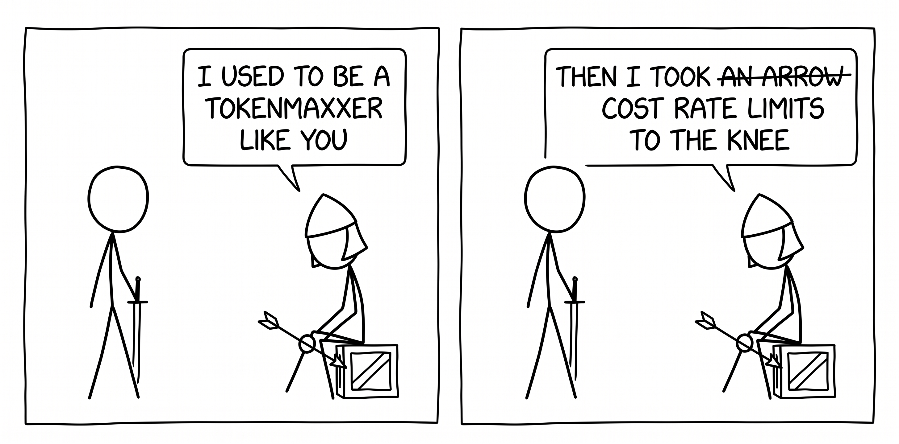

# Copilot Context-Engineering

_Should an agent rule go into repository instructions, an agent skill, or a custom subagent?_

## Background

There will come a time when your employer says no to _"[Tokenmaxxing](https://www.ibm.com/think/insights/tokenmaxxing-dead-long-live-valuemaxxing)"_.

Because _"use as much AI as possible"_ without clearly defining success metrics, guardrails or cost expectations was never a value exercise; it was a learning experience.

However, once some of those cost guardrails are set, what happens next is a bunch of developers scrambling to amend or fix various AI instructions that were once "acceptable" but are now leaving them with very little usage allowance within the first few hours of the month. What next?

Luckily for us, the industry caught this problem long ago, and we now have various ways to optimise the context window to reduce cost and maximise output value. You just need to watch several talks, read several more articles, dig into the docs, and then hopefully, once your thoughts are in place, apply the learnings.

...or you can install and follow this interactive guide, which aims to give you a practical guide that looks into bad (and common!) usage patterns and suggests a better way to handle them.

## Who is this for?

Heavy Copilot users: the people who run it all day and feel the usage limits.

> [!IMPORTANT]
> Your first priority should be finding value in agentic AI.
> If Copilot is producing no value for you, **there is nothing to optimise** yet.

This is not for people who are new to Copilot or have never used it. Some of these lessons might be useful to know in advance, but they won't stick if applied prematurely. Come back once you start hitting your usage limits and wondering how to make your tokens stretch further.

## Get started

1. Start with [docs/PREREQUISITES.md](docs/PREREQUISITES.md) to install the tool and health-check your machine.
2. Follow the [docs/scenarios/README.md](docs/scenarios/README.md) walkthrough to start your visual learning journey.

If you're interested in a summary table to check whether anything piques your interest, see [docs/SUMMARY.md](docs/SUMMARY.md).

## Licence & Contributing

The project is MIT licensed; see [LICENSE](LICENSE).

If you find any issues, or you would like to improve the guide, please read the [CONTRIBUTING](CONTRIBUTING.md) guidelines. Improvements are highly welcome and appreciated.
