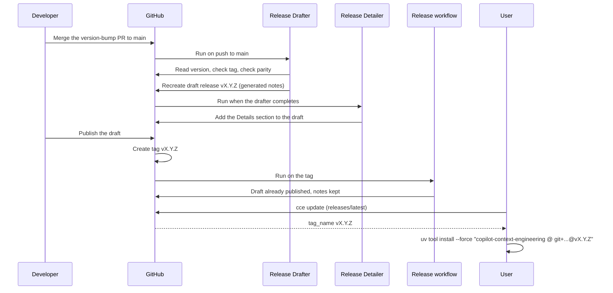

# Releasing

## Quick reference

1. Bump the version in `pyproject.toml` and `src/cce/__init__.py` in a PR.
2. Merge the PR to `main`.
3. The "Release Drafter" workflow creates the draft release, and "Release Detailer" adds a user-facing Details section to it.
4. Review it at <https://github.com/u-ways/copilot-context-engineering/releases>.
5. Click **Publish**.
6. Users run `cce update`.

## Owner setup (one-time)

1. Branch protection on `main` requiring the status checks `quality`, `test`, `smoke (ubuntu-latest)`, `smoke (macos-latest)` and `adr-review`, with the branch required to be up to date (strict), conversation resolution required, and the rules applied to administrators.
2. Add `RELEASE_AUTOMATION_TOKEN` under Settings > Secrets and variables > Dependabot, not Actions: a Dependabot merge made with that token pushes to `main` as a user, so it triggers CI and the Release Drafter. Without it the auto-merge falls back to `GITHUB_TOKEN`, whose pushes trigger neither.

## Version management

Versions follow [SemVer](https://semver.org/) and are static: no version is derived from git at build time.

| File | Field |
| --- | --- |
| `pyproject.toml` | `version` |
| `src/cce/__init__.py` | `__version__` |

> **Warning**
> The two values must match. `tests/test_version.py` and `just version` enforce this locally, and the Release Drafter workflow fails hard on a mismatch, so a drifted bump never reaches a draft.

## Release process

### Prepare

1. Open a PR that bumps both fields to the new version (`X.Y.Z`, no `v` prefix in the files).
2. Run `just version` and `just check` locally; both must pass.
3. Merge the PR to `main` with a squash merge.

Nothing else is required. Dependabot merges also push to `main`, but they do not change the version, so the drafter stops at its tag-exists check for them.

### Draft (automatic)

On every push to `main` the Release Drafter workflow:

1. Checks out the repository with full history.
2. Reads `version` from `pyproject.toml`.
3. Stops with a notice if the tag `vX.Y.Z` already exists. This is what happens on every Dependabot merge.
4. Fails if `__version__` in `src/cce/__init__.py` differs from that version.
5. Deletes every existing draft release (there is only ever the one in flight; published releases are never drafts).
6. Creates the draft for `vX.Y.Z` with GitHub's generated notes, grouped by pull-request label as configured in `.github/release.yml` (unlabelled PRs land under "Changed").

### Detail (automatic)

When the drafter finishes, the "Release Detailer" workflow:

1. Looks for a draft release and stops, at no cost, when there is none (every push that did not bump the version).
2. Has Claude read the pull requests and diff in the release range and write the full new body to a file: the generated notes verbatim, then a `### Details` section describing what users will see or do differently and whether any action is needed. Claude has read-only tools plus `Write`; it cannot touch a release.
3. Applies the file with `gh release edit --notes-file`, after checking again that the target is still a draft.

Run it by hand from the Actions tab (`workflow_dispatch`, optional `tag`) to re-detail a draft after editing it.

### Publish

Publishing the draft creates the tag. The "Release" workflow then runs on the tag and leaves the release as it is, notes included; it exists for the other two starting states. Run it manually with `workflow_dispatch` and a `version` input to create the tag if needed and publish whatever exists for it: a draft is published unchanged, a published release is left alone, and when nothing exists a release is created with generated notes. Notes are never regenerated for an existing release, which is what used to duplicate them.

End to end:



## User update experience

Users install the tool from git:

```sh
uv tool install "copilot-context-engineering @ git+https://github.com/u-ways/copilot-context-engineering"
```

After a successful command (except `version`, `update` and `--help`), `cce` checks for a newer release at most once a day. It fetches the repository's `releases/latest` endpoint on the GitHub API with a short timeout and compares the release `tag_name` with `cce.__version__`.

- On a TTY, a newer release triggers a `Y/n` prompt; answering yes installs exactly the announced tag with `uv tool install --force "copilot-context-engineering @ git+https://github.com/u-ways/copilot-context-engineering@vX.Y.Z"`. `cce update` runs the same command.
- Without a TTY, a one-line notice is printed to stderr and nothing else happens.
- The check never fails a command: network errors, malformed responses, a missing release and an unwritable cache are all swallowed at debug level and the exit code is unchanged.

A `git+https` install without a ref tracks `main` until the first `cce update`, which pins the tool to the release it installs; later releases move the pin on. `uv tool upgrade` is not used because it does nothing for a pinned install and would move an unpinned one to the head of `main`. To install a specific release by hand:

```sh
uv tool install --force "copilot-context-engineering @ git+https://github.com/u-ways/copilot-context-engineering@vX.Y.Z"
```

## Update Configurations

| Variable | Effect | Default |
| --- | --- | --- |
| `CCE_UPDATE_INTERVAL` | Seconds between update checks | `86400` |
| `CCE_DISABLE_UPDATE_CHECK` | Any value disables the update check | unset |
| `CI` | Disables the update check; set by CI systems | unset |
