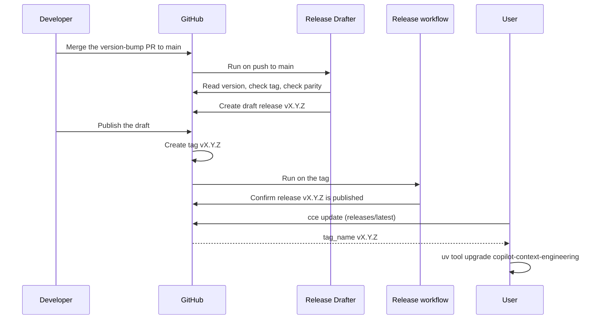

# Releasing

## Quick reference

1. Bump the version in `pyproject.toml` and `src/cce/__init__.py` in a PR.
2. Merge the PR to `main`.
3. The "Release Drafter" workflow creates a draft release automatically.
4. Review it at <https://github.com/u-ways/copilot-context-engineering/releases>.
5. Click **Publish**.
6. Users run `cce update`.

## Version management

Versions follow [SemVer](https://semver.org/) and are static: no version is derived from git at build time.

| File | Field |
| --- | --- |
| `pyproject.toml` | `version` |
| `src/cce/__init__.py` | `__version__` |

> **Warning**
> The two values must match. `tests/test_version.py` and `just version` enforce this locally, and the Release Drafter workflow fails hard on a mismatch, so a drifted bump never reaches a draft.

## Release process

### Prepare

1. Open a PR that bumps both fields to the new version (`X.Y.Z`, no `v` prefix in the files).
2. Run `just version` and `just check` locally; both must pass.
3. Merge the PR to `main` with a squash merge.

Nothing else is required. Dependabot merges also push to `main`, but they do not change the version, so the drafter stops at its tag-exists check for them.

### Draft (automatic)

On every push to `main` the Release Drafter workflow:

1. Checks out the repository with full history.
2. Reads `version` from `pyproject.toml`.
3. Stops with a notice if the tag `vX.Y.Z` already exists. This is what happens on every Dependabot merge.
4. Fails if `__version__` in `src/cce/__init__.py` differs from that version.
5. Deletes any existing draft release for that tag.
6. Creates a draft release for `vX.Y.Z` with generated release notes.

### Publish

Publishing the draft creates the tag. The "Release" workflow then runs on the tag and confirms the release is published. Alternatively, run the "Release" workflow manually with `workflow_dispatch` and a `version` input; it creates the tag if needed and publishes the release whether a draft, a published release or nothing exists for that tag.

End to end:



## User update experience

Users install the tool from git:

```sh
uv tool install "copilot-context-engineering @ git+https://github.com/u-ways/copilot-context-engineering"
```

After a successful command (except `version`, `update` and `--help`), `cce` checks for a newer release at most once a day. It fetches the repository's `releases/latest` endpoint on the GitHub API with a short timeout and compares the release `tag_name` with `cce.__version__`.

- On a TTY, a newer release triggers a `Y/n` prompt; answering yes runs `uv tool upgrade copilot-context-engineering`.
- Without a TTY, a one-line notice is printed to stderr and nothing else happens.
- The check never fails a command: network errors, malformed responses, a missing release and an unwritable cache are all swallowed at debug level and the exit code is unchanged.

A `git+https` install without a ref tracks `main`, so an upgrade may land a commit at or after the announced tag rather than exactly the tag. To install exactly one release:

```sh
uv tool install --force "copilot-context-engineering @ git+https://github.com/u-ways/copilot-context-engineering@vX.Y.Z"
```

## Configuration

| Variable | Effect | Default |
| --- | --- | --- |
| `CCE_UPDATE_INTERVAL` | Seconds between update checks | `86400` |
| `CCE_DISABLE_UPDATE_CHECK` | Any value disables the update check | unset |
| `CI` | Disables the update check; set by CI systems | unset |
| `CCE_WORKSPACE` | Workspace path override | `$XDG_DATA_HOME/cce`, falling back to `~/.local/share/cce` |
| `CCE_LOG_FORMAT` | Log renderer on stderr: `console` or `json` | `console` |
| `CCE_RELEASES_URL` | Endpoint consulted for the latest release (tests and forks) | the GitHub `releases/latest` API |
